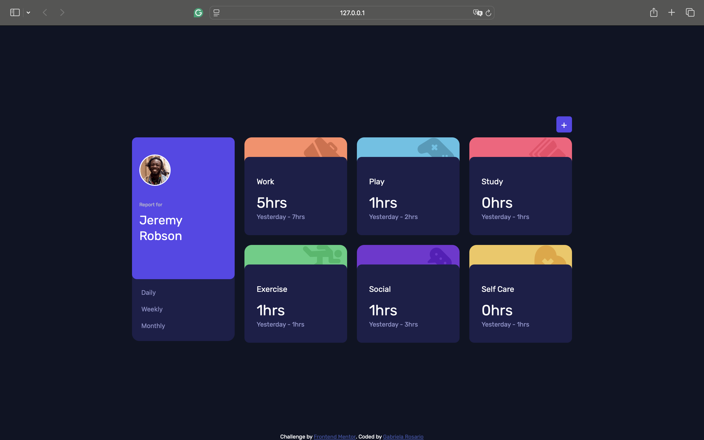

# Frontend Mentor - Time tracking dashboard solution

This is a solution to the [Time tracking dashboard challenge on Frontend Mentor](https://www.frontendmentor.io/challenges/time-tracking-dashboard-UIQ7167Jw). Frontend Mentor challenges help you improve your coding skills by building realistic projects. 

## Table of contents

- [Overview](#overview)
  - [The challenge](#the-challenge)
  - [Screenshot](#screenshot)
  - [Links](#links)
- [My process](#my-process)
  - [Built with](#built-with)
  - [What I learned](#what-i-learned)
  - [Continued development](#continued-development)
- [Author](#author)

**Note: Delete this note and update the table of contents based on what sections you keep.**

## Overview

### The challenge

Users should be able to:

- View the optimal layout for the site depending on their device's screen size
- See hover states for all interactive elements on the page
- Switch between viewing Daily, Weekly, and Monthly stats

### Screenshot



### Links

- Solution URL: [Add solution URL here](https://your-solution-url.com)
- Live Site URL: [Add live site URL here](https://rosariorgabriela.github.io/timeTrackingDashboard/)

## My process

### Built with

- Semantic HTML5 markup
- CSS custom properties
- Flexbox
- CSS Grid
- Javascript (DOM Manipulation, JSON fetching)

### What I learned

While working on this project, I learned how to:
- Fetch and process JSON data dynamically.
- Implement overlays in CSS.
- Create and manage modals/pop-ups using Javascript for user input.
- Dynamically update the DOM with new activity cards.

```css
.card:not(.user-card) .overlay {
    background-color: hsl(235, 46%, 20%);
    position: absolute;
    width: 100%;
    height: 80%;
    bottom: 0;
    left: 0;
    border-radius: 10px;
    padding: 25px;
    box-sizing: border-box;
}
```

```css
.modal {
    display: none;
    position: fixed;
    z-index: 1;
    top: 50%;
    left: 50%;
    transform: translate(-50%, -50%);
    background: white;
    color: hsl(235, 46%, 20%);
    padding: 20px;
    border-radius: 10px;
    box-shadow: 0 0 10px rgba(0, 0, 0, 0.3);
}
```

```js
document.getElementById("add-card-btn").addEventListener("click", () => {
        document.getElementById("add-activity-modal").style.display = "block";
      });
      
      document.getElementById("close-modal").addEventListener("click", () => {
        document.getElementById("add-activity-modal").style.display = "none";
      });
```

In the future, I want to continue focusing on Javascript, particularly working with JSON data, improving UI interactions, and enhancing user experience with better animations and dynamic content updates.

## Author

- Github - [rosariorgabriela](https://github.com/rosariorgabriela)
- Frontend Mentor - [@rosariorgabriela](https://www.frontendmentor.io/profile/rosariorgabriela)